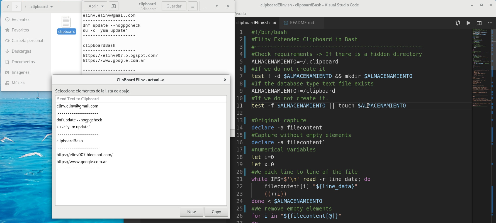

 

# clipboardBash
	Elinv Extended Clipboard in Bash

#Eso: 
	expand the possibilities of the clipboard (clipboard)
	in Linux and in bash

---
    Information of the team in which this bash was developed:
    ------------------------------------------------------------------
    Fedora 29.
    Procesador intel Core i7
    Gnome Versión 3.30.2
    Tipo de SO: 64 bits.
    g++ (GCC) 8.3.1 20190223 (Red Hat 8.3.1-2)
    gtk version 3.24.1
    glade 3.22.1
    Visual Studio Code Versión: 1.32.3
    -----------------------------------------------------------------
---

## Requirements:
---
Instalar xclip

Installing Xclip on Ubuntu
sudo apt-get install xclip

Installing Xclip on CentOS 7 / RHEL 7 / Fedora
sudo yum install xclip
dnf install xclip

Installing Xclip on Arch Linux
sudo pacman install xclip
whereis xclip

---

[Spanish]
Para ejecutarlo rapidamente he creado en

Configuración -> Dispositivos -> Teclado
un acceso directo al archivo bash (clipboardElinv.sh)

Al atajo creado le he puesto el nombre "Clipboard"
el comando es el path relativo y el nombre y extensión de nuestro bash
y la combinación de letras ha sido Ctrl+Shift+4 (del teclado numérico)

Bueno ya tengo mi portapapeles ampliado!

Si quieren mejorarlo con mayor gusto, manos a la obra.
Si desean acercar la colaboración pueden hacerlo a:
elinv.elinv@gmail.com

Saludos hermanos del mundo!

---

[English]
To execute it quickly I created in

Configuration -> Devices -> Keyboard
a shortcut to the bash file (clipboardElinv.sh)

To the created shortcut I have put the name "Clipboard"
the command is the relative path and the name and extension of our bash
and the letter combination has been Ctrl + Shift + 4 (from the numeric keypad)

Well I have my clipboard enlarged!

If you want to improve it with greater pleasure, get to work.
If you wish to bring the collaboration closer you can do it to:
elinv.elinv@gmail.com

Greetings brothers of the world!
---

# clipboardBash
# Elinv Extended Clipboard in Bash
## [SOLUCIONADO] {SOLVED}

✅**Version 1.0**
- Ver desarrollo del Proyecto explicativo en:

<a href="https://elinv007.blogspot.com/2019/03/c-cpp-glade-gtk3-signal-handlers-error.html">
   Enlace a la explicación del bash -> en Blogger
</a>

- Ver web blogger de Elinv con este y otros proyectos mas aqui:

<a href="https://elinv007.blogspot.com/">
   Enlace a la web de Elinv  -> en Blogger
</a>

- Ver info de Elinv en Google Search:

<a href="https://www.google.com.ar/search?q=elinv">
   Enlace a la info de Elinv  -> en Google Search
</a>

- Ver canciones de Elinv:

<a href="https://www.reverbnation.com/elinv">
   Enlace a las canciones de Elinv  -> en Reverbnation
</a>

👍 Gracias!

🛠️ Errores, sugerencias, ideas, envialas a nuestro mail: <elinv.elinv@gmail.com>

## 	Demo

# E L I N V
